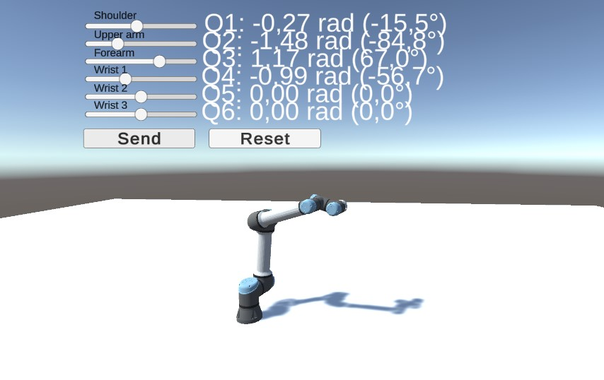

# Субоптимальное управление роботом-манипулятором на основе мультимодальных входных данных

Проект представляет собой симуляционный прототип системы управления шестиосевым манипулятором Universal Robots UR5e. Управление строится на отслеживании опорной траектории минимального рывка с помощью конечногоризонтного LQR. Для визуализации движения используется Unity, а вычисления выполняются C++ backend на базе Drogon.



## Основные возможности

- управление шестью суставами манипулятора UR5e;
- планирование траектории минимального рывка;
- конечногоризонтный LQR с обратной рекурсией Риккати;
- вычисление желаемых суставных ускорений;
- вычисление управляющих моментов методом обратной динамики;
- упрощённая нелинейная модель динамики манипулятора;
- учёт гравитации, вязкого и кулонового трения;
- ограничение ускорений и управляющих моментов;
- численное интегрирование состояния манипулятора;
- фильтр Калмана для оценки положения и скорости суставов;
- REST API для обмена данными между C++ backend и Unity;
- Python-скрипты для запуска LQR-экспериментов, расчёта метрик и построения графиков.

## Архитектура

Система состоит из двух основных компонентов:

| Компонент | Назначение |
|---|---|
| C++ backend | Планирование траектории, LQR/PD, динамика, обратная динамика, фильтр Калмана и REST API |
| Unity | Визуализация UR5e, панель управления и передача запросов backend |

Для экспериментального анализа также используются Python-скрипты, которые обращаются к backend через HTTP.

```text
Целевая конфигурация суставов
             │
             ▼
Планирование траектории minimum-jerk
             │
             ▼
q_ref(t), dq_ref(t), ddq_ref(t)
             │
             ▼
Конечногоризонтный LQR или PD
             │
             ▼
Желаемое ускорение ddq_des
             │
             ▼
Обратная динамика
             │
             ▼
Управляющие моменты tau
             │
             ▼
Модель динамики UR5e
             │
             ▼
Новое состояние q и dq
             │
             ▼
Визуализация движения в Unity
```

## Технологии

- C++17;
- Drogon;
- CMake;
- JsonCpp;
- Unity 2022.3 LTS;
- C#;
- Python;
- NumPy;
- Pandas;
- Matplotlib;
- HTTP/JSON.

## Структура проекта

```text
robot_arm/
├── README.md
├── sim.jpg
│
├── robot_arm/
│   ├── CMakeLists.txt
│   ├── main.cc
│   ├── config.json
│   ├── config.yaml
│   │
│   ├── controllers/
│   │   ├── ArmController.h
│   │   └── ArmController.cc
│   │
│   ├── include/
│   │   ├── dynamics.hpp
│   │   └── trajectory.hpp
│   │
│   ├── lqr_experiments/
│   │   ├── README.md
│   │   ├── run_experiments.py
│   │   ├── analyze.py
│   │   └── requirements.txt
│   │
│   ├── models/
│   ├── test/
│   │   └── test_main.cc
│   └── test_episode.sh
│
└── UR5e_unity/
    ├── Assets/
    ├── Packages/
    └── ProjectSettings/
```

## Математическая модель

### Динамика манипулятора

Движение манипулятора в суставных координатах описывается уравнением

$$
M(q)\ddot q+n(q,\dot q)=\tau,
$$

где:

- $q\in\mathbb{R}^{6}$ — вектор суставных координат;
- $\dot q\in\mathbb{R}^{6}$ — вектор суставных скоростей;
- $\ddot q\in\mathbb{R}^{6}$ — вектор суставных ускорений;
- $M(q)$ — приближённая матрица инерции;
- $n(q,\dot q)$ — нелинейные составляющие модели;
- $\tau\in\mathbb{R}^{6}$ — вектор управляющих моментов.

В проекте используется упрощённая симуляционная модель. Она предназначена для исследования алгоритма управления и не является полной заводской динамической моделью реального UR5e.

Нелинейная часть учитывает гравитацию и трение. Трение включает вязкую и кулоновскую составляющие:

$$
F_i(\dot{q}_i)=B_i\dot{q}_i+F_{c,i}\,\mathrm{sgn}(\dot{q}_i)
$$

Желаемое ускорение преобразуется в управляющие моменты с помощью обратной динамики:

$$
\tau=M(q)\ddot q_{\mathrm{des}}+n(q,\dot q).
$$

Состояние манипулятора обновляется полуявным методом Эйлера:

$$
\dot q(t+\Delta t)=\dot q(t)+\ddot q(t)\Delta t,
$$

$$
q(t+\Delta t)=q(t)+\dot q(t+\Delta t)\Delta t.
$$

## Планирование траектории

Для каждого сустава строится полином пятой степени:

$$
q_i(t)=a_0+a_1t+a_2t^2+a_3t^3+a_4t^4+a_5t^5.
$$

Коэффициенты определяются по начальным и конечным условиям положения, скорости и ускорения. В стандартном сценарии движение начинается и заканчивается с нулевой скоростью и нулевым ускорением.

Планировщик формирует:

- $q_{\mathrm{ref}}(t)$ — опорное положение;
- $\dot q_{\mathrm{ref}}(t)$ — опорную скорость;
- $\ddot q_{\mathrm{ref}}(t)$ — опорное ускорение.

Такая траектория обеспечивает плавное перемещение без скачков положения, скорости и ускорения.

## Конечногоризонтный LQR

Для каждого сустава используется локальная модель ошибки:

$$
x_k=
\begin{pmatrix}
e_{q,k}\\
e_{\dot q,k}
\end{pmatrix},
$$

где

$$
e_q=q-q_{\mathrm{ref}},
\qquad
e_{\dot q}=\dot q-\dot q_{\mathrm{ref}}.
$$

Дискретная модель двойного интегратора имеет вид

$$
x_{k+1}=Ax_k+Bu_k,
$$

$$
A=
\begin{pmatrix}
1 & \Delta t\\
0 & 1
\end{pmatrix},
\qquad
B=
\begin{pmatrix}
\frac{1}{2}\Delta t^2\\
\Delta t
\end{pmatrix}.
$$

Минимизируется функционал

$$
J=
\sum_{k=0}^{N-1}
\left(
x_k^{T}Qx_k+Ru_k^2
\right)
+x_N^{T}Q_Nx_N,
$$

где

$$
Q=\mathrm{diag}(w_q,w_{\dot{q}}),
\qquad
R=w_u
$$

$$
Q_N=\mathrm{diag}(w_{qN},w_{\dot{q}N})
$$

Коэффициенты обратной связи вычисляются обратной рекурсией Риккати. Командное ускорение определяется выражением

$$
\ddot{q}_{des,i} = \ddot{q}_{ref,i} - K_q e_{q,i} - K_{dq} e_{dq,i}
$$

Параметры $w_q$, $w_{\dot q}$ и $w_u$ определяют соотношение между точностью отслеживания и интенсивностью управления. Параметры $w_{qN}$ и $w_{\dot qN}$ задают штраф за конечную ошибку.

## PD-режим

В проекте предусмотрен дополнительный режим управления

$$
\ddot q_{\mathrm{des}} = \ddot q_{\mathrm{ref}} -k_pe_q-k_de_{\dot q}.
$$

Он используется для проверки и сравнения с конечногоризонтным LQR. В отличие от LQR, коэффициенты PD-регулятора задаются непосредственно и не вычисляются через рекурсию Риккати.

## Фильтр Калмана

Для каждого сустава оценивается состояние

$$
\hat x=
\begin{pmatrix}
\hat q\\
\hat{\dot q}
\end{pmatrix}.
$$

Измеряемой величиной является положение сустава. Фильтр выполняет этап предсказания и этап коррекции, позволяя получать сглаженные оценки положения и скорости при наличии измерительного шума.

## REST API

Основные маршруты backend:

| Endpoint | Метод | Назначение |
|---|---|---|
| `/arm/plan_minjerk_q` | POST | Построение траектории минимального рывка |
| `/arm/set_reference` | POST | Установка и сохранение опорной траектории |
| `/arm/step` | POST | Выполнение одного шага управления |

### Установка опорной траектории

```bash
curl -X POST http://127.0.0.1:8848/arm/set_reference \
  -H "Content-Type: application/json" \
  -d '{
    "q_start": [0, 0, 0, 0, 0, 0],
    "q_target": [0.8, -0.6, 0.7, -0.4, 0.5, -0.3],
    "T": 1.5,
    "dt": 0.02
  }'
```

### Выполнение шага управления

```bash
curl -X POST http://127.0.0.1:8848/arm/step \
  -H "Content-Type: application/json" \
  -d '{
    "q": [0, 0, 0, 0, 0, 0],
    "dq": [0, 0, 0, 0, 0, 0],
    "t": 0.0,
    "dt": 0.02,
    "mode": "lqr",
    "wq": 40.0,
    "wdq": 8.0,
    "wu": 0.4,
    "wqN": 80.0,
    "wdqN": 15.0,
    "horizonN": 20,
    "u_max": 8.0
  }'
```

Перед вызовом `/arm/step` необходимо установить опорную траекторию через `/arm/set_reference`.

## Сборка backend

### Требования

- CMake 3.5 или новее;
- компилятор с поддержкой C++17;
- установленный Drogon;
- JsonCpp.

### Сборка

```bash
cd robot_arm
mkdir -p build
cd build
cmake .. -DCMAKE_BUILD_TYPE=Release
cmake --build . -j
```

### Запуск

```bash
./robot_arm
```

Сервер запускается на

```text
http://0.0.0.0:8848
```

## Запуск Unity

1. Открыть каталог `UR5e_unity` в Unity 2022.3 LTS.
2. Открыть основную сцену с моделью UR5e.
3. Проверить адрес backend в C#-клиенте.
4. Запустить C++ backend.
5. Запустить сцену Unity.

При локальном запуске используется адрес:

```text
http://127.0.0.1:8848
```

## Эксперименты LQR

Каталог `robot_arm/lqr_experiments` содержит скрипты для количественной оценки регулятора.

В экспериментах выполняются:

- базовое отслеживание опорной траектории;
- изменение штрафа за управление $w_u$;
- изменение горизонта LQR;
- проверка нескольких целевых конфигураций;
- сохранение временных рядов в CSV;
- вычисление RMS-ошибки;
- вычисление максимальной и конечной ошибки;
- вычисление энергии управления;
- вычисление ITAE;
- построение графиков;
- формирование итоговой таблицы.

### Установка зависимостей

```bash
cd robot_arm/lqr_experiments
pip install -r requirements.txt
```

### Запуск экспериментов

Сначала необходимо запустить C++ backend, затем выполнить:

```bash
python run_experiments.py
```

### Анализ результатов

```bash
python analyze.py
```

Результаты сохраняются в каталоге `results`.

## Метрики качества

Для оценки работы регулятора используются:

| Метрика | Назначение |
|---|---|
| RMS-ошибка положения | Среднее отклонение суставных координат от опорной траектории |
| RMS-ошибка скорости | Среднее отклонение суставных скоростей |
| Максимальная ошибка | Наибольшее отклонение за весь эксперимент |
| Конечная ошибка | Ошибка после завершения движения |
| Энергия управления | Интенсивность управляющих моментов |
| ITAE | Интегральная ошибка, взвешенная по времени |

## Запуск тестов

После сборки проекта:

```bash
cd build
./test/robot_arm_test
```

## Автор

**Эспиноса Василита Кристина Микаела** — 1032224624@rudn.ru

### Со-автор

**Киселёв Глеб Андреевич** — kiselev-ga@rudn.ru
